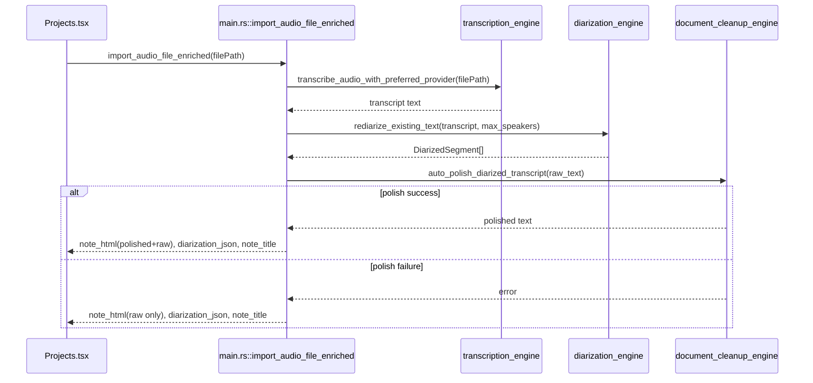

# Diarization Architecture (Platypus)

## Scope
This document describes the diarization architecture currently implemented in Platypus, the architectural choices and tradeoffs, and the code adjustments required to evolve the current implementation.

It covers:
- Local recording diarization flow
- Re-diarization of existing text
- Audio import post-processing flow
- Post-diarization polish and raw transcript presentation
- Current constraints and next implementation steps

## Architecture Diagrams

### Component view
```mermaid
flowchart LR
  A[Audio Source\nLocal Recording or Imported File] --> B[Transcription Layer\nLocal Whisper or OpenAI]
  B --> C{Diarization Enabled}
  C -- No --> D[Raw Transcript]
  C -- Yes --> E[Diarization Layer\nStreamingDiarizer or Text Re-diarization]
  E --> F[Speaker Segments\nDiarizedSegment[]]
  F --> G[Post-processing\nAuto-Polish + Language Mode]
  G --> H[Renderer\nPolished + Raw HTML]
  D --> H
  H --> I[(projects_activities.full_document_text)]
  F --> J[(projects_activities.diarization_json)]
  H --> K[Frontend Editor\nTipTap]
```

### Audio import enriched sequence


## Current Architecture

### High-level pipeline
1. Audio is captured (local recording) or imported (ogg/wav/mp3).
2. Speech transcription is produced (local Whisper or OpenAI, with fallback logic).
3. Diarization is applied when enabled:
- Live local recording: chunk-level assignment during capture plus final merge.
- Existing transcript/imported audio: text-based re-diarization pass.
4. Post-processing runs at diarization completion:
- Auto-polish with LLM (language mode aware).
- Raw transcript preserved and rendered.
5. Final note is persisted as polished-first + raw-readable content.

### Backend modules and responsibilities
- `src-tauri/src/engine/diarization_engine.rs`
- Provides `StreamingDiarizer` (centroid tracking, cosine similarity, thresholding).
- Provides `DiarizationEngine` model loader and embedding API.
- Provides text-level re-diarization (`rediarize_existing_text`).
- Provides speaker-segment formatting and merge helpers.

- `src-tauri/src/main.rs`
- Wires commands into Tauri.
- Maintains global runtime state (`DIARIZATION_ENGINE`, `STREAMING_DIARIZER`, `DIARIZED_SEGMENTS`).
- Applies diarization during recording stop path.
- Exposes re-diarization command for existing notes.
- Composes polished/raw HTML structures.
- Handles enriched audio import (`import_audio_file_enriched`) with diarization, polish, and smart note title generation.

- `src-tauri/src/engine/document_cleanup_engine.rs`
- Implements transcript polish logic.
- Supports language behavior:
  - `keep_original`
  - `translate` to target language.
- Provides short note title generation for imported audio notes.

- `src-tauri/src/engine/transcription_engine.rs`
- Handles OpenAI Whisper upload constraints.
- Normalizes `.ogg` to WAV for compatibility.
- Applies compression ladder and chunked transcription fallback for large files.

### Frontend integration
- `src/features/Projects/Projects.tsx`
- Uses enriched audio import command.
- Saves returned note HTML, title, and diarization JSON.
- Displays live speaker-colored chunks during local recording.
- Provides manual "Redo diarization" action.

- `src/features/GeneralSettings.tsx`
- Exposes diarization controls (`use_diarization`, `max_speakers`).
- Exposes post-diarization language controls:
  - `polish_language_mode`
  - `polish_target_language`.

## Implemented Data and Rendering Model

### Segment model
`DiarizedSegment`:
- `speaker_id: u32`
- `text: String`

### Persisted outputs
- `diarization_json` stores structured diarization segments.
- Note body stores HTML with two logical sections:
1. Polished transcript (if polish succeeds)
2. Raw transcript (always intended to remain readable)

### Presentation behavior
- Local live preview: speaker-colored labels in recording panel.
- Saved note: polished-first and raw section for post-diarized content.
- Imported audio now follows enriched post-processing pipeline for consistency.

## Architectural Choices and Tradeoffs

### Choice 1: Streaming centroid diarizer for runtime assignment
Why:
- Lightweight and fast enough for local real-time UX.
- Minimal dependencies for online assignment.

Tradeoffs:
- Speaker identity is heuristic and may drift over long sessions.
- Threshold tuning impacts false splits vs merges.

### Choice 2: Text-based re-diarization fallback for existing transcripts/imports
Why:
- Enables diarization even when only text is available.
- Avoids blocking on full audio embedding pipeline.

Tradeoffs:
- Lower fidelity than acoustic speaker embeddings.
- Depends on punctuation and transcript quality.

### Choice 3: Preserve raw transcript while auto-polishing
Why:
- Maintains auditability and trust.
- Allows users to inspect unmodified content.

Tradeoffs:
- Larger note body storage.
- Potential duplication/noise for long transcripts.

### Choice 4: Language-aware polish mode
Why:
- Supports both strict source-language retention and translation workflows.

Tradeoffs:
- Translation can introduce subtle semantic shifts.
- Additional model variance by provider.

### Choice 5: Enriched import command returns structured payload
Why:
- Keeps orchestration centralized in backend.
- Reduces frontend branching and duplicated post-processing logic.

Tradeoffs:
- Larger backend command surface area.
- Requires stronger contract/version stability between frontend and backend.

### Choice 6: Smart note title generation (date/time + short semantic title)
Why:
- Better retrieval and scanning than filename-only naming.

Tradeoffs:
- LLM dependency for best results.
- Needs deterministic fallback on model failure.

## Current Limitations
1. `DiarizationEngine::embed` currently uses a temporary baseline embedding path and not a full ONNX forward pass.
2. `batch_recluster` is intentionally minimal; full agglomerative post-cluster refinement is not yet complete.
3. Imported-note speaker coloring is rendered in generated HTML; editor-level semantic segment rendering is still basic.
4. Long-note HTML representation (polished + raw) may become heavy for very long meetings.

## Required Code Adjustments (Next Iteration)

### P0 (correctness and consistency)
1. Implement true ONNX inference in `DiarizationEngine::embed` and validate embedding dimensionality consistency.
2. Upgrade `batch_recluster` with real cluster refinement and deterministic speaker ID remapping.
3. Add integration tests for `import_audio_file_enriched` output contract:
- `note_html` non-empty
- `diarization_json` present when diarization enabled
- fallback behavior when polish fails.
4. Ensure raw transcript readability invariant in all post-diarization save paths.

### P1 (quality and UX)
1. Unify HTML composition helpers in one module to avoid divergence between flows.
2. Add explicit metadata marker in note HTML for polished/raw sections for future editor tooling.
3. Add per-import toast summary with polish status and diarization status.
4. Add title sanitization and max-length normalization tests.

### P2 (performance and maintainability)
1. Add caching/reuse strategy for diarization model and embedding computations for repeated operations.
2. Introduce bounded processing for very large transcripts to avoid UI payload bloat.
3. Add benchmark suite for:
- real-time local chunk diarization latency
- import post-processing total latency by file size.

## Operational Settings
- `use_diarization` (bool)
- `max_speakers` (int)
- `polish_language_mode` (`keep_original` or `translate`)
- `polish_target_language` (string)

These settings are persisted through existing settings repository and consumed by backend processing paths.

## Validation Checklist
1. Local recording + diarization enabled:
- final note contains diarization and polished/raw structure.
2. Import `.ogg` / `.wav` / `.mp3`:
- diarization applied (if enabled), polished/raw generated, title includes datetime + short topic.
3. Re-do diarization:
- re-segmentation saved, polished/raw regenerated.
4. Polish failure scenario:
- raw transcript still saved and readable.
5. Language mode behavior:
- keep original vs translate target language verified.

## References (key code entry points)
- `src-tauri/src/engine/diarization_engine.rs`
- `src-tauri/src/engine/transcription_engine.rs`
- `src-tauri/src/engine/document_cleanup_engine.rs`
- `src-tauri/src/main.rs`
- `src/features/Projects/Projects.tsx`
- `src/features/GeneralSettings.tsx`
- `src/Providers/SettingsProvider.tsx`
